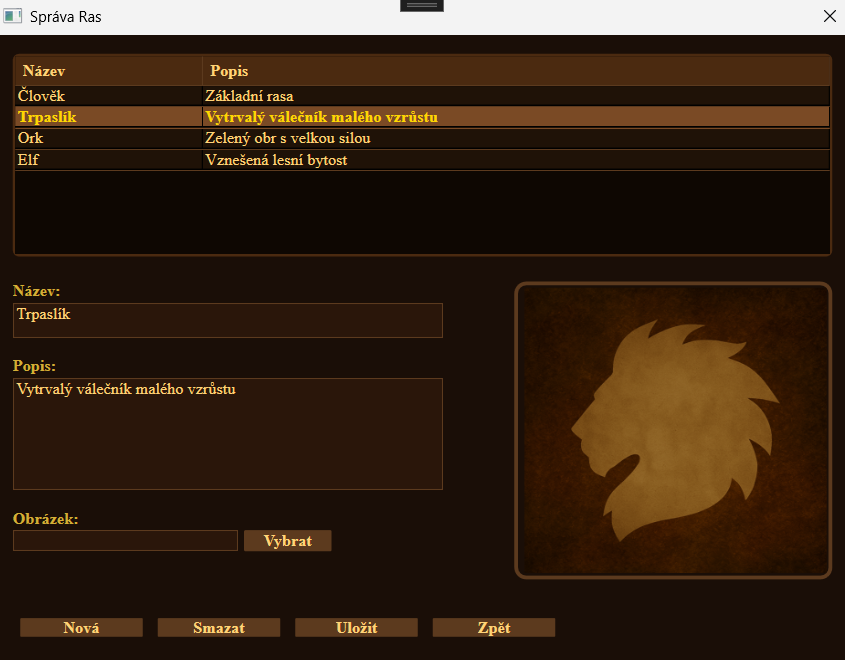
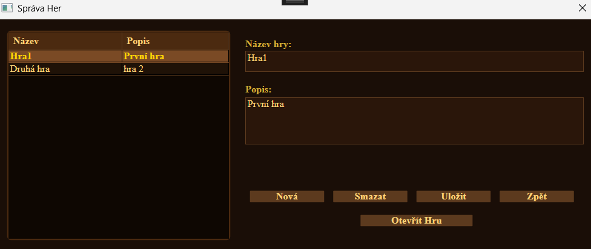
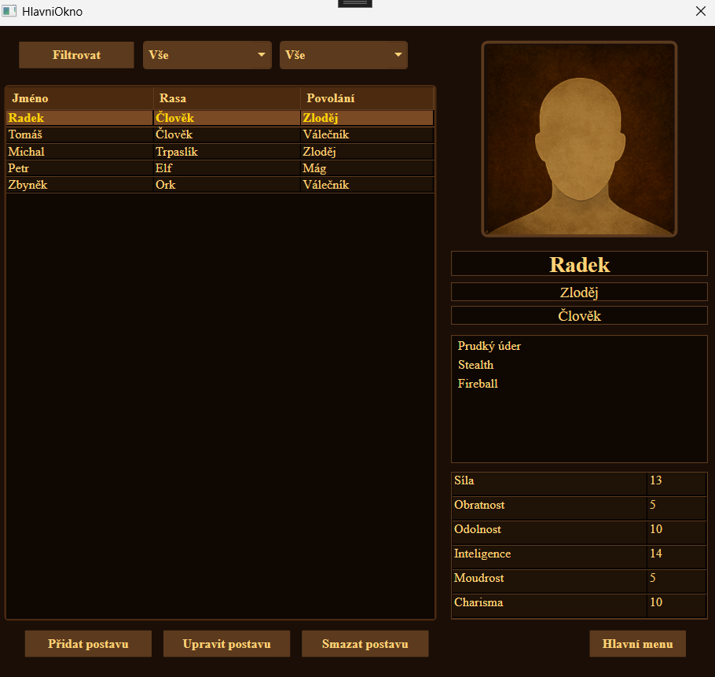
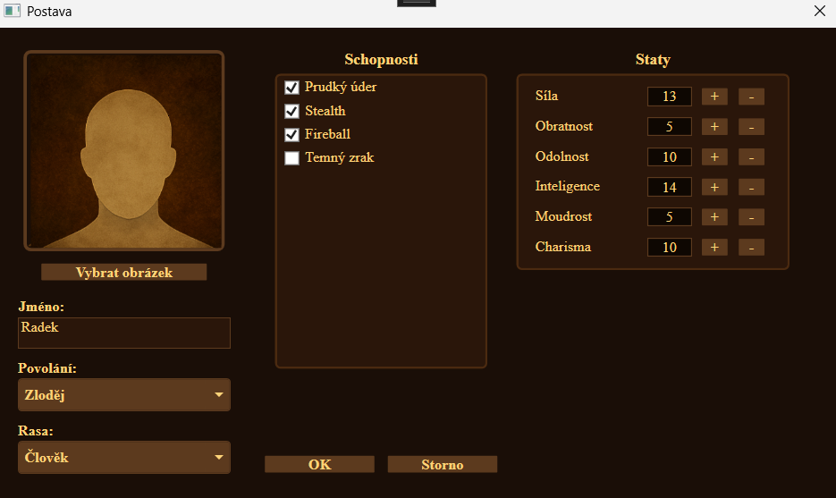

# Generator RPG postav

## Popis projektu

Aplikace **Generator RPG** slouží ke správě a tvorbě RPG postav.

Uživatel může pracovat s těmito entitami:
- **Rasa**
- **Povolání**
- **Schopnost**
- **Postava**
- **Hra**

Data jsou ukládána do embedded databáze **LiteDB**.

---

## Struktura projektu

- **Assets** - assety pro aplikaci, obrázky
- **Data** – entity aplikace, modely (Postava, Rasa, ...)
- **Spravce** – správci dat, virtuální reprezentace dat v databázi
- **ViewModels** – logika aplikace, viewmodely (SpravaRasViewModel, ...)
- **Views** – UI, views (SpravaRasView, ...)

---

## Spuštění aplikace

1. Otevřít projekt ve **Visual Studio**
2. Spustit aplikaci (`F5`)
3. Aplikace se otevře v hlavním menu

---

## Návod pro použití aplikace

### Správa Povolání/Schopností/Ras
- Stisknutím tlačítka *Povolání/Schopnosti/Rasy* z hlavního menu se otevře okno pro správu dané **entity**.

- Tyto entity představují vlastnosti, které je možné následně přiřadit jednotlivým postavám.
- Pro vytvoření nového záznamu, stiskněte **Nové/á**. Textboxy se vyčistí a aplikace se přepne do režimu přidání. Po vyplnění pole pro **Název** lze volitelně přidat i **Popis** a **Obrázek** (ve *správě Schopností* existuje ještě volitelné pole *Typ Schopnosti*). Aby se přidání potvrdilo, stiskněte **Přidat**, pokud chcete režim přidání opustit bez uložení, stiskněte **Zrušit**.
- Pro úpravu existujícího záznamu, stačí daný záznam zvolit v horním seznamu a do polí se **automaticky vyplní** údaje, které lze upravovat. Pro uložení změn v daném záznamu stiskněte **Uložit**.
- Pro odstranění záznamu z databáze vyberte záznam pro smazání z horního seznamu a stiskněte **Smazat**. Otevře se dialog pro smazání.

---

### Správa Her

- Pokud z hlavního menu zvolíte tlačítko *Hry*, otevře se **Správa Her**. 

- Jednotlivé hry představují separátní **seznamy postav**, např. pro různé kampaně.
- Po vybrání hry ze seznamu nalevo ji pomocí tlačítka **Otevřít Hru** otevřete.
- Pro vytvoření nové hry, stiskněte **Nová**. Textboxy se vyčistí a aplikace se přepne do režimu přidání. Po vyplnění pole pro **Název** lze volitelně přidat i **Popis**. Aby se přidání potvrdilo, stiskněte **Přidat**, pokud chcete režim přidání opustit bez uložení, stiskněte **Zrušit**.
- Pro úpravu existující hry, vyberte hru v seznamu nalevo a do polí se **automaticky vyplní** údaje, které lze upravovat. Pro uložení změn stiskněte **Uložit**.
- Pro odstranění hry z databáze ji vyberte ze seznamu nalevo a stiskněte **Smazat**. Otevře se dialog pro smazání.

---

### Správa Postav

- Po otevření konkrétní **hry** se zobrazí **hlavní okno** aplikace, které obsahuje detailní **výpis všech postav** pro aktuální hru/kampaň.

- Velkou část okna zabírá seznam postav, vpravo se nachází detailní popis aktuálně vybrané postavy a dole jsou tlačítka pro správu. Seznam lze i filtrovat podle rasy a povolání.
- Pro přidání *nové postavy* stiskněte tlačítko **Přidat postavu** a otevře se dialog pro přidání postavy. Pro úpravu již *existující postavy* ji označte v seznamu a stiskněte tlačítko **Upravit postavu**, otevře se dialog pro úpravu.
- Pro smazání postavy ji označte v seznamu a stiskněte **Smazat postavu**.

### Přidávání/Úprava Postav

- Toto okno se používá pro **přidávání a úpravu postav**. Do Textboxu je potřeba zadat **Jméno** postavy a z Comboboxů vybrat **Povolání** a **Rasu**. V poli pro **Schopnosti** zaškrtněte požadované schopnosti postavy a v tabulce **Staty** můžete upravit staty postavy.
- Pro **uložení** nové/upravené postavy stiskněte **OK**, pokud chcete z dialogu **odejít bez uložení**, stisknětě **Storno**.

---

## Použité technologie

- C#
- .NET (net9.0)
- WPF
- MVVM
- [LiteDB](https://www.litedb.org/)

---

## Autor

**Matěj Adamec**  
BCSH2 – semestrální práce  
2025
